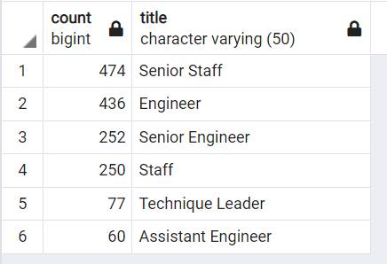
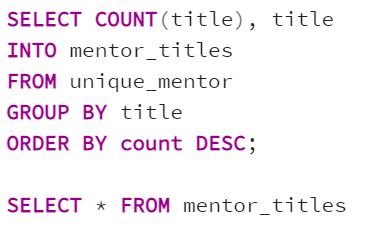

# Pewlett-Hackard-Analysis
### Colin Leung

## Overview of the Analysis
The purpose of this analysis was the calculate the amount of retiring employees in a company, determined by employee age. The given data included all current and former employees and their birth date. In the final table produced by the POSTGRES Query, the titles of these employees were displayed in a list only including current employees in a certain age range, born between January 1, 1952 and December 31, 1955. By using the DISTINCT ON function, the table eliminated duplicate names and only included the most recent title of each employee. Additionally, another table was created for employees eligible for the mentorship program which included employees born between January 1, 1965 and December 31, 1965.

## Results
### Retired by employee title
1) 25916 Senior Engineers, 24926 Senior Staff, 9285 Engineer, 7636 Staff, 3603 Technique Leaders, 1090 Assistant Engineer, and 2 Managers retired. Since so few managers retired while so many engineers retired, company should adjust hiring focus more towards engineers and less for mangers. 
2) 133,776 retired overall but 72,458 unique employee retired. 61,318 duplicate employee entries. Almost half of the employee entries were duplicates so in the titles csv which displays all employees, the true total amount of employees should be much less. However, total employees should not be around half since the deliverable only analyzed retiring employees which implies they have worked more positions. 
3) Total of 443308 employee titles in the company. Large amount of senior positions retired so promote more current employees. 
4) 1549 employees avaiable for Mentorship Program. The total employees born in the year 1965 is much less than those born between 1952 and 1955. Since 72,458 employees will need to be replaced, these mentors will have nearly 46 new generation employees to teach.

## Summary
There are a total of 72,458 unique employee titles in the retirement pool and to neutralize the loss, those roles will need to be filled. There were a total of 1549 employees available for the mentorship program. Thus, each retirement-ready employee will have to mentor about 46 new employees each from the new generation of Pewlett Hackard employees. As seen in the table below, the engineers and staff should be able to mentor these new employees with ease however, the technique leaders may have more difficulty since there are inly 77 of them. 

